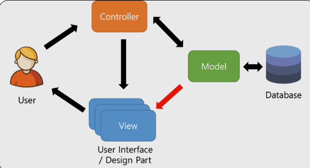

# MVC 패턴
- ---------


MVC(Model-View-Controller)패턴은 소프트웨어 아키텍처 디자인 패턴으로, 소프트웨어를 구성하는 요소들을 Model, View, Controller 세 가지 요소로 나누어서 각 요소가 서로 분리되어 동작하도록 하는 방법이다.

### Model
애플리케이션의 데이터 및 비지니스 로직을 담당하고 `View`에 보여질 데이터를 나타낸다. 데이터에 대한 로직을 정의하고, DB와 같은 데이터 소스와 상호작용하며, 이 데이터를 핸들링(CRUD)하는 메서드를 제공한다. 데이터 변경시 `Controller`에 알려야한다.

### View
사용자 인터페이스(UI)를 나타낸다. 사용자에게 정보를 보여주고, 사용자의 입력에 따라 `Controller`에 알린다. `View`는 `Model`을 직접 조작하지 않으며, 모델과 독립적으로 작동한다.

### Controller
`Model`과 `View`사이에서 중개자 역할을 한다. 사용자의 입력을 수신하고, 이를 기반으로 `Model`의 데이터를 업데이트하거나, `View`를 업데이트한다.

### MVC 패턴 적용시 이점
1. 유지보수와 확장성이 높아진다.

    MVC 패턴은 각 요소가 독릭적으로 작동한다. 변경 사항이 다른 요소에 영향이 미치지 않도록 설계되어있다. 따라서 코드 수정이나 추가 작업을 수행할 때 다른 요소를 건드리지 않아도 되므로, 유지보수성과 확장성이 높아진다.


2. 코드의 재사용성이 높아진다.

    각 요소가 분리되어 있기 때문에, 재사용하기가 쉽다.


3. 일관된 코드 구조를 유지할 수 있다.

    각 요소가 분리되어 있고, 요소마다 책임과 역할이 분명하게 정의되어 있으므로 코드의 가독성과 이해도가 높아진다.


4. 테스트가 용이하다.

    각 요소가 독립적으로 작동하기 때문에, 테스트가 용이하다. Ex) Model을 테스트한다면 데이터 처리 로직만 테스트하면 된다.

### 안드로이드에서 MVC 패턴은 어떻게 사용될까?
안드로이드에선 `Activity`와 `Fragment`가 `View`와 `Controller`를 가지고 있다.
```kotlin
button.setOnclickListener {
    // Model에 데이터 갱신 요청 -> 서버나, 로컬 DB
    // Model에서 전달받은 데이터를 통해 View 갱신
    val response = model.data
    nickname.text = response.nickname
}
```
하나의 화면 안에서 클릭 이벤트가 발생하고, 이를 View에서 모두 처리하는 형태이다.

하지만 안드로이드에서 MVC패턴은 잘 사용되지 않는데, 그 이유는 하나의 Activity나 Fragment에서 모든 걸 다 동작하게 처리만 해주면 되므로 코드의 양이 증가하고, 그로 인해 복잡도 증가, 유지보수의 어려움, 테스트 코드 작성, 마지막으로 View와 Model간의 결합도가 높아 MVC 패턴보다 MVVM, MVI 패턴이 안드로이드에서 개발 방식과 더욱 잘 맞는 패턴이다.
(MVP, MVVM, MVI 포스팅하기.)


### 문제
1. MVC 패턴에서 각 요소가 하는 일을 설명하세요.
2. MVC 패턴을 적용했을 때, 얻는 이점을 설명하세요.
3. 자신이 하고있는 분야에서 MVC 패턴을 적용해서 간략히 설명하세요. 


### 출처
https://devbin.kr/web-mvc-model-view-controller-%EC%9D%98-%EA%B0%9C%EB%85%90/

https://thdev.tech/androiddev/2016/10/23/Android-MVC-Architecture/

